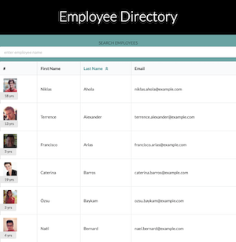

# Employee-Directory

React app allows user to view their entire employee directory at once for quick access to their information.

## Table of Contents

- [Description](#description)
- [Technologies](#technologies)
- [Visuals](#visuals)
- [Contributions](#contributions)
- [Contact Me](#questions)
- [License](#license)

## Description

React app allows user to view their entire employee directory at once for quick access to their information. User is able to search by employee name and recieve live filtered results, as well as sort employee last names in ascending alphebetcial order.

## Technologies

- React
- Random User API
- Semantic UI React

## Visuals

[GithubPages_Deployment](https://nahco-code.github.io/Employee-Directory/)

## Contributions

Sole Author: k.wilkinson

This project was completed as an individual assignment for The Ohio State University Coding Boot Camp.

## Questions?

Please feel free to contact with any questions via email or LinkedIn.

- Github: [NAHco-code](https://github.com/NAHco-code)
- LinkedIn: [kwilkinsonxx](https://www.linkedin.com/in/kwilkinsonxx/)
- Email: [kathrynxwilk@gmail.com](kathrynxwilk@gmail.com)

## License

This project is licensed under the MIT License.
For more information, please visit: [MIT Explained](https://choosealicense.com/licenses/mit/)

&copy; 2021 k.wilkinson
